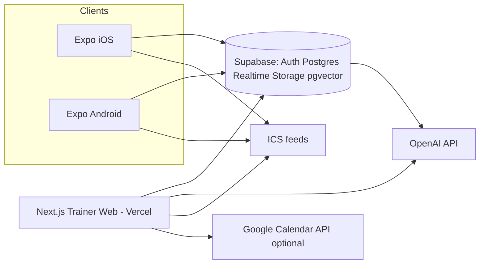

# CoachLoop Architecture

**Date:** 2026-10-06 (America/Chicago)  
**Audience:** Speedy → Forge (after Mission Control ticket 10)  
**Product shape:** Native mobile clients (iOS **and** Android, first-class) + trainer web desk; lean accountability OS + confidence-gated AI.  
**Prior art:** `gap-deep-dive.md`, `prd-coachloop.md` (PWA-era — treat as superseded on delivery shape).

---

## 1. One-liner stack

**Expo (iOS+Android) + Next.js trainer web on Vercel, Supabase (Auth/Postgres/Realtime/Storage/pgvector) as the backend fabric, OpenAI for LLM, calendar via ICS subscribe/export (+ optional Google Calendar OAuth).**

---

## 2. Primary stack (locked for v1)

| Layer | Choice | Why |
| --- | --- | --- |
| **Trainer web** | Next.js 15 (App Router) on **Vercel** | Free hobby tier; SSR/API routes for OAuth callbacks, RAG orchestration, webhooks |
| **Client mobile** | **Expo (React Native)** — **iOS and Android both first-class from day one** | One codebase; Expo Go / EAS dev builds for demo; shared CoachLoop-branded apps (no white-label store listings in v1) |
| **Shared UI/types** | `packages/*` in monorepo (Zod schemas, API client, design tokens) | Keep web + mobile in sync without duplicating domain types |
| **DB** | **Supabase Postgres** (free) | Single project for data + auth + realtime + storage |
| **Auth** | **Supabase Auth** | Same project; email/magic-link + invite tokens; RLS-friendly `auth.uid()` |
| **Realtime** | **Supabase Realtime** | Chat + inbox presence without a second vendor |
| **Vector / RAG** | **pgvector** on Supabase | Trainer KB + per-client program chunks; tenant-scoped queries |
| **File storage** | **Supabase Storage** | FAQ PDFs, exercise video URLs (link-out OK), avatars |
| **LLM** | **OpenAI** API (`gpt-4o-mini` default; bump for demo if needed) | Cheap, not self-hosted; confidence + refusal classifiers in app code |
| **Calendar** | **ICS subscribe/export first**; optional **Google Calendar OAuth** as a second path | Trainers/clients not locked to Google; iCal works with Apple Calendar, Outlook, Fastmail, etc. |
| **Push** | Expo Notifications (FCM/APNs via EAS) | Missed-workout / check-in nudges on both platforms |
| **Repo** | GitHub under **`jaysinghcodes`** | Free; Vercel + Supabase free tiers |

### Footnote — alternate path (do not mix mid-build)

If Jay later wants to leave Supabase: **Neon Postgres + Clerk Auth + Vercel Blob + Ably (or Supabase Realtime-only as a bolt-on)** for DB/auth/files/realtime. Same Expo + Next.js frontends. Switching mid-v1 is costly; pick Supabase and stay there for the showcase.

---

## 3. Repo layout (monorepo)

```
coachloop/
├── apps/
│   ├── web/                 # Next.js — trainer desk (+ thin marketing/landing)
│   └── mobile/              # Expo — client app (iOS + Android equal)
├── packages/
│   ├── api/                 # Typed fetch / Supabase client helpers
│   ├── db/                  # SQL migrations, RLS policies, seed SQL
│   ├── domain/              # Zod schemas: Program, Log, Message, AuditEvent, InboxItem
│   ├── ai/                  # RAG retrieve, confidence score, refusal rules, prompt templates
│   └── ui/                  # Shared tokens / small presentational bits (optional)
├── docs/
│   ├── architecture.md      # symlink or copy of this doc
│   ├── demo-script.md
│   └── eval-messages.json   # ≥20 canned client messages
├── turbo.json / pnpm-workspace.yaml
└── README.md
```

**Platform note:** `apps/mobile` targets **both** iOS and Android in the same Expo project (`ios` + `android` dirs via prebuild when needed). CI and README must show both simulators/dev builds. Do **not** ship iOS-only then “Android later.”

---

## 4. Multi-tenant isolation

### Model

- **Org = one trainer (v1).** No franchise/team RBAC.
- Every row carries `org_id` (UUID). Clients belong to exactly one org.
- Supabase **RLS** on all tables: trainer sees own org; client sees only own profile, assigned program, own logs, own chat thread, own bookings.
- **RAG index** rows also carry `org_id` (+ optional `client_id` for program chunks). Retrieval **must** filter `org_id = current_org` and, for program context, `client_id = asking_client`. Never cross-tenant embed search.
- Storage paths: `org/{org_id}/kb/...`, `org/{org_id}/clients/{client_id}/...`.

### Roles

| Role | Surfaces |
| --- | --- |
| `trainer` | **Web desk:** clients, programs, KB, accountability board, priority inbox, AI settings, audit log, calendar/ICS, settings |
| `client` | **Mobile (iOS+Android):** today’s workout, set/weight logging, chat, check-in prompts, book/cancel via ICS/Google, push |
| `system` | Background jobs: embedding, confidence pipeline, nudge scoring, ICS feed generation |

Trainer mobile companion = **out of v1** (web desk is enough for demo).

---

## 5. RAG scope, confidence gate, refusals, audit

### Retrieval scope (hard)

For a client message in org O / client C:

1. Trainer FAQ/KB chunks where `org_id = O` and `scope IN ('org','faq')`
2. That client’s **assigned program** chunks where `org_id = O AND client_id = C`
3. **Never** other clients’ programs, other orgs, or open-web browse

### Confidence gate

```
retrieve(k) → score(retrieval + answerability) → check_refusals()
  ├─ hard_refuse  → no auto-send; escalate PriorityInbox + AuditEvent(refuse)
  ├─ confidence < threshold → draft only; escalate + AuditEvent(escalate)
  └─ confidence ≥ threshold → auto-send (if trainer setting allows) + AuditEvent(auto_send)
```

- Threshold configurable per org (demo default: auto-send FAQ/program lookups; never medical).
- Confidence visible in trainer UI and audit (e.g. `0.0–1.0` + short reason codes: `retrieval_gap`, `ambiguous`, `refusal_keyword`, …).
- If discovery later kills auto-send: keep draft-only path; architecture unchanged.

### Hard refusals (always escalate, never invent clinical guidance)

- Injury / pain diagnosis or treatment (“what should I do about my knee”)
- Medication / supplement as medical advice
- Emergency / chest pain / severe symptoms → refuse + “contact emergency services / your clinician” canned text + escalate
- Anything outside coach scope that sounds clinical

**Product posture:** general wellness / coaching ops software. **Not** a regulated medical device. App Store / Play health declaration: **No** (wellness/coaching). Hard-refuse injury/med in code **and** copy.

### Audit log (required for every AI action)

Store at minimum:

| Field | Purpose |
| --- | --- |
| `id`, `org_id`, `client_id`, `message_id` | Trace |
| `retrieved_chunk_ids` + snippets | Sources |
| `draft_text` | What model proposed |
| `confidence`, `reason_codes` | Gate explanation |
| `decision` | `auto_send` \| `escalate` \| `hard_refuse` |
| `trainer_edit` / `final_text` | Human override |
| `model`, `prompt_version`, `created_at` | Repro / liability story |

Trainer web: filterable audit table + deep-link from inbox item. Export JSON for README/demo.

---

## 6. Accountability OS (lead product narrative)

Not “another Everfit.” Lead story = **replace WhatsApp chaos** with:

1. **Structured logging** on mobile (sets/weights/skip/done) — both platforms
2. **Check-in triage** signals (missed workout, unanswered chat > N hours, injury keywords, AI escalate)
3. **Who-needs-a-nudge** board on trainer web (priority sort, not a flat chat list)

Chat and confidence AI support this ops loop; they are not the homepage pitch alone.

---

## 7. Calendar: iCal-first (+ optional Google)

### Requirements (Jay addendum)

- Trainers/clients must **not** be locked to Google.
- Support **ICS subscribe and/or export** (and CalDAV-style patterns only if free-tier simple — prefer ICS feeds for v1).
- Google Calendar OAuth may remain as **one optional path**.

### v1 design

| Capability | How |
| --- | --- |
| Trainer availability | Stored in Postgres (`availability_blocks`, `sessions`) |
| Client book/cancel | Mobile UI writes `sessions`; triggers feed regen |
| **ICS export** | Authenticated or tokenized `.ics` download of upcoming sessions |
| **ICS subscribe** | Stable HTTPS feed URL per user (`/api/cal/{token}.ics`) — Apple Calendar / Outlook / Google “From URL” |
| Google OAuth (optional) | If connected, push/create events via Calendar API; disconnect must leave ICS working |
| Timezones | Store UTC; display in user timezone |

Ticket 6 owns implementation. Demo happy path: book on mobile → event appears via ICS subscribe in a desktop calendar app; Google path is bonus if credentials exist.

---

## 8. What stays free vs paid limits

Approximate free-tier reality for a **recruiting showcase / few demo orgs** (verify current vendor limits at build time):

| Service | Free / cheap OK for demo | Likely first paid wall |
| --- | --- | --- |
| Vercel Hobby | Web app + serverless | Bandwidth / cron / team features |
| Supabase Free | DB, Auth, Realtime, Storage, pgvector small | DB size, egress, Realtime connections, Storage |
| Expo / EAS | Expo Go + limited builds | EAS build minutes; Apple Dev **$99/yr** when submitting |
| OpenAI pay-as-you-go | Tiny demo usage | Any real multi-trainer traffic |
| Google Cloud OAuth | Free API quota | Unusual at showcase scale |
| ICS feeds on Vercel/Supabase | Free | Caching/CDN if abused |

**Store submit:** later. Demo with Expo Go and/or EAS **dev builds on both iOS and Android**. Shared CoachLoop branding only (white-label App Store listings = cut).

---

## 9. App Store / Play notes

- **v1 demo:** Expo Go + EAS development builds for **iOS and Android**.
- **Later submit:** single CoachLoop-branded apps (not per-trainer white-label).
- Category framing: **general wellness / coaching ops** — programming, logging, messaging, scheduling.
- Declare **not** a regulated medical device (Apple 2026 health/fitness declaration → **No** if wellness-only).
- In-app + AI: hard-refuse injury/medication/emergency clinical advice; escalate to trainer.
- Privacy policy + minimal PII before any real (non-seed) users.
- Push notification entitlements on both platforms via Expo.

---

## 10. System diagram



**Data plane:** Mobile and web talk to Supabase (RLS). Sensitive AI orchestration (prompt assembly, refusal, audit write) prefers Next.js server routes / Edge functions so keys never ship in the mobile binary. Mobile may call Supabase directly for CRUD covered by RLS; AI send path goes through a trusted server endpoint.

---

## 11. Environment & secrets (Forge checklist)

- `SUPABASE_URL`, `SUPABASE_ANON_KEY`, `SUPABASE_SERVICE_ROLE` (server only)
- `OPENAI_API_KEY` (server only)
- `GOOGLE_CLIENT_ID` / `SECRET` (optional calendar path)
- `ICS_FEED_SIGNING_SECRET` (tokenized subscribe URLs)
- `EXPO_PUBLIC_SUPABASE_URL` / `EXPO_PUBLIC_SUPABASE_ANON_KEY`
- Vercel project ↔ GitHub `jaysinghcodes/coachloop` (name flexible)

---

## 12. Explicit non-goals (architecture)

Do not add infrastructure for: nutrition DB, wearables pipelines, payments marketplace, white-label store listings, gamification, camera form AI, franchise RBAC, self-hosted LLMs, PWA-only client.

---

*End of architecture.md — primary path is Supabase + Expo (iOS+Android) + Next.js/Vercel + OpenAI + ICS-first calendar.*
